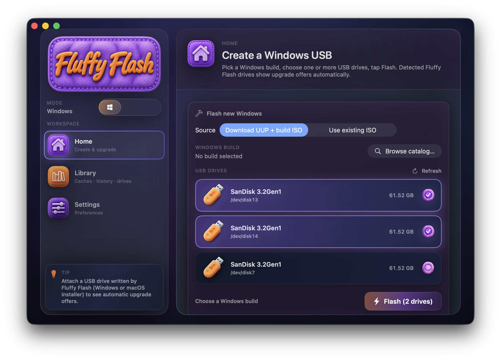
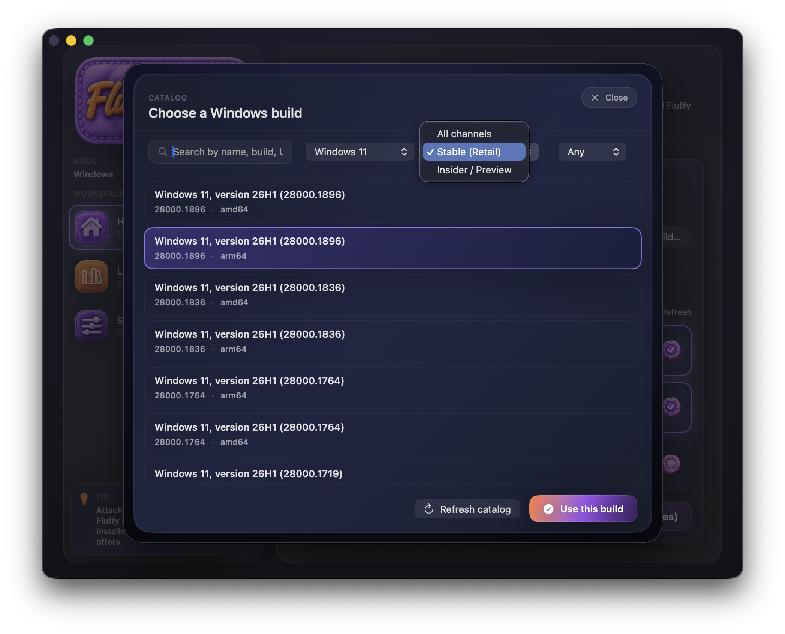
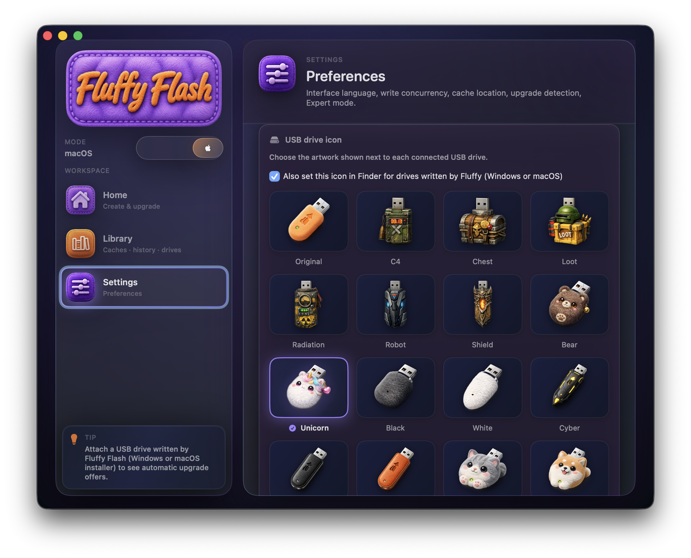
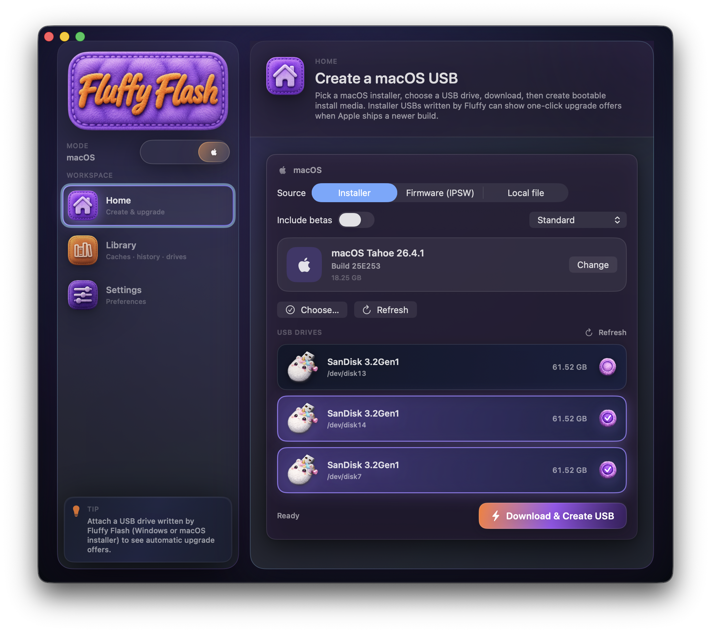
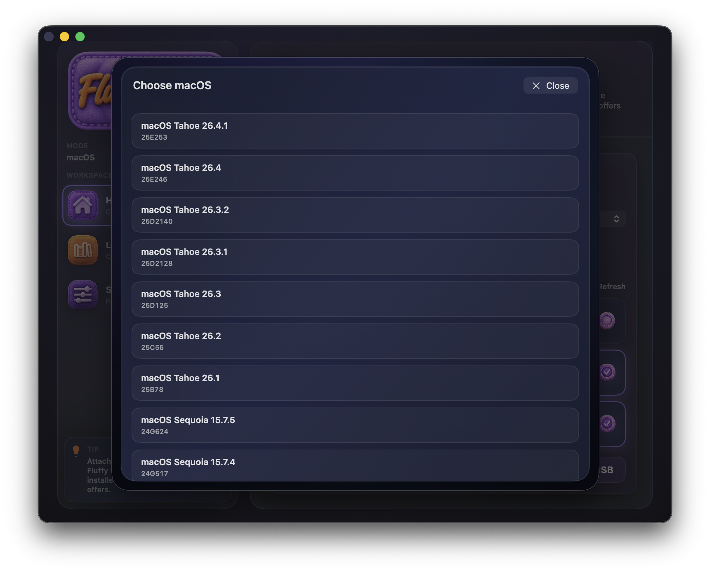

# Fluffy Flash

**Fluffy Flash** — macOS‑приложение (SwiftUI), которое помогает:

- скачать исходные файлы сборок Windows через [UUPDump](https://uupdump.net)
- собрать **ISO** и/или записать **загрузочную USB‑флешку установщика Windows** на Mac
- (дополнительно) работать с загрузками macOS‑инсталляторов и IPSW через `mist` в соответствующем режиме приложения

Ключевая идея: в релизных сборках **не требовать от пользователей Homebrew** — нужные CLI‑инструменты могут быть упакованы внутрь `.app` (и их лицензии/обязательства ведутся отдельно).

  

## Возможности

- **UUP → ISO**: запуск официального `convert.sh` (UUP converter) с контролем прогресса  
- **ISO → USB**: запись установочной флешки (FAT32‑разметка + работа с `install.wim`)  
- **Скачивание зависимостей “под ключ”**: релизный `.app` может включать `aria2c`, `cabextract`, `wimlib-imagex`, `xorriso` (или совместимый `mkisofs`/`genisoimage`), `chntpw` и др.  
- **Privileged helper**: для операций, где macOS требует повышенные права (диски/разделы)  
- **Комплаенс third‑party**: учёт bundled‑компонентов в [`FluffyFlash/THIRD_PARTY.md`](FluffyFlash/THIRD_PARTY.md) и notices в [`FluffyFlash/THIRD_PARTY_NOTICES.txt`](FluffyFlash/THIRD_PARTY_NOTICES.txt)

## Системные требования

- **macOS**: зависит от текущего `MACOSX_DEPLOYMENT_TARGET` в Xcode‑проекте (см. `Fluffy Flash.xcodeproj`).  
- **Архитектура**:
  - текущий релиз может быть ориентирован на Apple Silicon
  - **поддержка Intel планируется в следующей версии** (важно: для Intel нужно упаковывать CLI‑инструменты соответствующей архитектуры)

## Скачать

Стабильные сборки публикуются в **GitHub Releases**: https://github.com/zeroman27/FluffyFlash/releases

## Скриншоты

Файлы лежат в `docs/images/` (рекомендации по экспорту/неймингу: [`docs/images/README.md`](docs/images/README.md)).

  
  

  
  

## Сборка из исходников

Подробно: **[`FluffyFlash/README.md`](FluffyFlash/README.md)**.

Коротко:
- проект Xcode: `FluffyFlash/Fluffy Flash.xcodeproj`
- схема: `FluffyFlash`
- чтобы ускорить итерации и не скачивать bundled tools на каждой сборке, можно использовать `WIST_SKIP_TOOL_BUNDLE=1`

Автоматизация релизов/подпись/нотаризация: **[`docs/RELEASING.md`](docs/RELEASING.md)** и **[`FluffyFlash/docs/Signing.md`](FluffyFlash/docs/Signing.md)**.

## FAQ / Troubleshooting

См. **[`docs/FAQ.md`](docs/FAQ.md)**.

## Структура репозитория

- **`FluffyFlash/`**: Xcode‑проект, исходники приложения, скрипты, third‑party inventory  
- **`docs/`**: заметки для мейнтейнеров (релизы, процессы), ассеты для README  
- **`ObsidianVault/`**: внутренняя база знаний/планирование (не требуется для сборки приложения)

## Как помочь проекту

См. **[`CONTRIBUTING.md`](CONTRIBUTING.md)**.

## Лицензия

Исходники: **Apache License 2.0** — см. [`LICENSE`](LICENSE).

Third‑party бинарники и их обязательства: [`FluffyFlash/THIRD_PARTY.md`](FluffyFlash/THIRD_PARTY.md) и [`FluffyFlash/THIRD_PARTY_NOTICES.txt`](FluffyFlash/THIRD_PARTY_NOTICES.txt).

## Безопасность

Приложение работает с дисками и сетевыми загрузками; sandbox намеренно ограничен для USB‑workflow. Для ответственного репорта уязвимостей: **[`SECURITY.md`](SECURITY.md)**.
